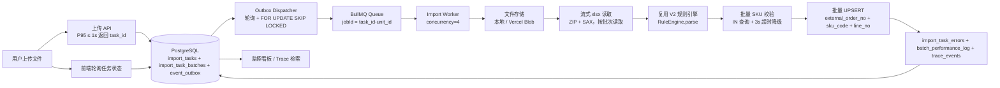

# 架构设计文档

## 1. 总体链路



## 2. 异步任务模型

### 表

| 表 | 职责 |
|---|---|
| `import_tasks` | 任务主表：状态、总行数、进度、成功/失败、降级标记、trace_id |
| `import_task_batches` | 处理单元：`task_id + unit_id` 唯一，批次状态机、重试次数、锁定时间 |
| `event_outbox` | 本地可靠事件表：pending → sent/failed，带 `next_retry_at` |
| `import_task_errors` | 行级错误明细 |
| `batch_performance_log` | 每批解析/规则/校验/写入/总耗时 |
| `trace_events` | 全链路时间线事件 |
| `waybills` | 运单主表（新链路落库目标，业务键唯一索引） |
| `sku_master` | SKU 主数据（压测与校验） |

### 状态机

任务状态：

```text
pending -> processing -> completed
                      -> partial_success
                      -> failed
```

批次状态：

```text
pending -> processing -> completed
                      -> retry (重试未耗尽)
                      -> failed (重试耗尽 / 超时)
```

## 3. Transactional Outbox

上传接口在**同一个数据库事务**内完成：

1. 插入 `import_tasks`；
2. 插入全部 `import_task_batches`；
3. 插入每个批次的 `ImportBatchCreated` 事件到 `event_outbox`；
4. 写入 `ImportTaskCreated` trace。

事务提交前崩溃：任务不可见，无脏数据；提交后崩溃：Dispatcher 轮询到 pending 事件继续投递。投递成功后标记 `sent`；若进程在“入队成功、更新状态前”崩溃，下次轮询会重复入队，但 BullMQ `jobId = task_id-unit_id` 保证同一处理单元只有一个 Job。

## 4. 处理单元与幂等

- 批大小默认 `BATCH_SIZE=1000`，按**数据行号**切分（`start_row/end_row` 为数据行，读取时映射回文件行）；
- 同一 `task_id + unit_id` 只有一个执行者：Worker 先做条件 UPDATE 抢占（`status IN (pending, retry)`），抢占失败即快速返回；
- 写库使用业务唯一键 `external_order_no + sku_code + line_no` 的 `ON CONFLICT DO UPDATE`，重复消费不会产生重复行；
- 进度更新使用原子 SQL：`processed_rows = processed_rows + N`，并发批次不丢计数。

## 5. 批量校验与批量写入

每个处理单元：

- 一次性收集 SKU 编码，`WHERE sku_code IN (...)` 批量查询 `sku_master`；
- 一次性收集外部单号，批量查询 `waybills` 已有键（跨任务重复检测）；
- 校验通过的行一次 `INSERT ... ON CONFLICT DO UPDATE`（单条多行 SQL）；
- 错误行一次多行 INSERT 进 `import_task_errors`；
- 不出现逐行 SELECT / 逐行 INSERT。

## 6. 可观测性

- 上传 API、Outbox、Queue Job、Worker、DB 日志均携带 `trace_id`；
- 每批记录 5 个耗时：parse / rule / validate / insert / total；
- 监控聚合 SQL 计算 P50/P95/P99、近 5 分钟吞吐、积压、错误分布、慢批次 TOP10；
- 看板数据来自 `batch_performance_log` 与 `import_task_batches` 真实聚合，非前端伪造。

## 7. 容灾与恢复

- **Outbox 失败重投**：投递失败写入 `retry_count + next_retry_at`，指数退避；
- **Serverless 拉取模式**：`QUEUE_DRIVER=db` 时，`/api/cron/process`（或上传后的 `after()` 踢单）直接抢占 pending/retry 批次并复用同一套 `processBatchJob` 状态机，Vercel 无需常驻 Worker；
- **卡死恢复**：Sweeper 将 `processing` 且 `locked_at` 超时的批次恢复为 `retry`，并重新创建 Outbox 事件；
- **丢失事件重建**：Sweeper 扫描 `pending` 任务，若批次存在但 Outbox 事件缺失则重建；
- **SKU 校验降级**：查询超过 `SKU_CHECK_TIMEOUT_MS`（默认 3s）或连接异常时，任务标记 `degraded`，跳过 SKU 主数据校验，仅做本地格式校验，并在前端明示风险。

## 8. 容量推导

实测 10,000 行（10 批 × 1000 行）在 Worker 并发 4 下全链路约 3.3s：

- 每批 parse 约 750ms、rule 约 13ms、validate 约 25ms、insert 约 215ms、total 约 980ms；
- 4 并发 × 10 批 ≈ 2.5 轮 × 1s ≈ 3s，与实测吻合；
- 数据库压力：单批 1 次 SKU IN 查询 + 1 次重复键 IN 查询 + 1 次批量 UPSERT + 1 次错误批量 INSERT，峰值连接数为 Worker 并发 × 每批连接数，连接池上限 10；
- 吞吐推算：单 Worker 4 并发约 12,000 行/分钟；扩容 Worker 或提高并发可线性扩展。

详细推导见 [REFACTORING_ASSUMPTIONS.md](REFACTORING_ASSUMPTIONS.md)。
